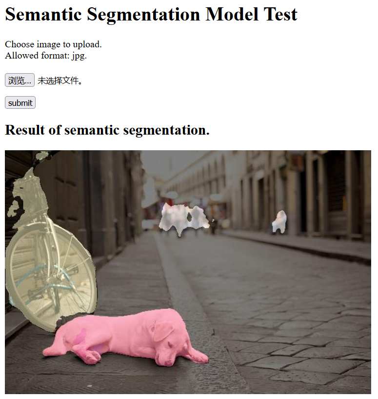
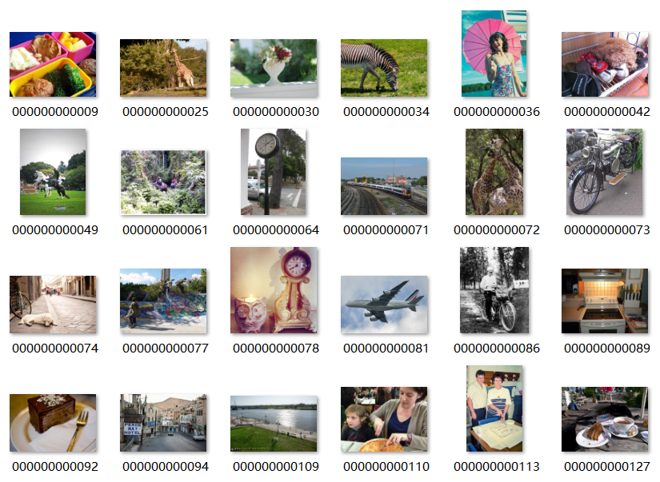
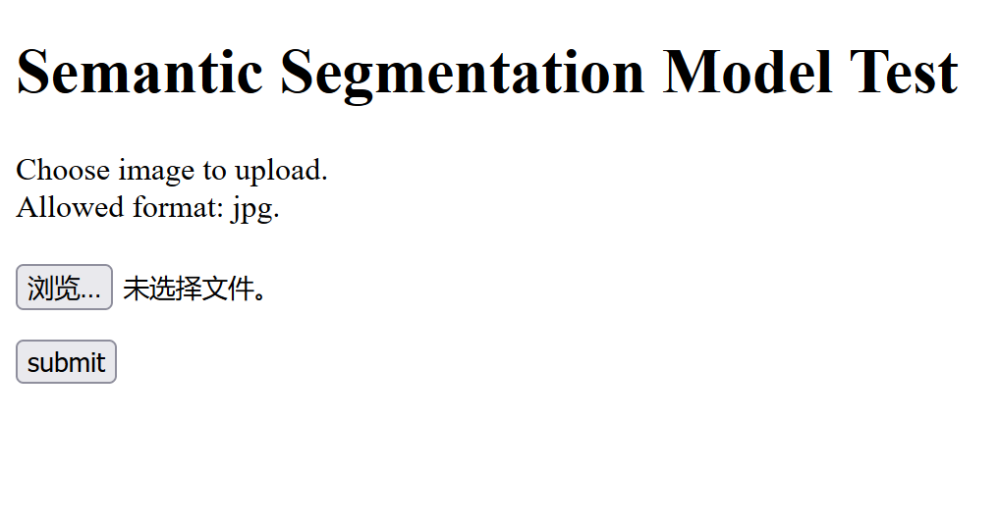
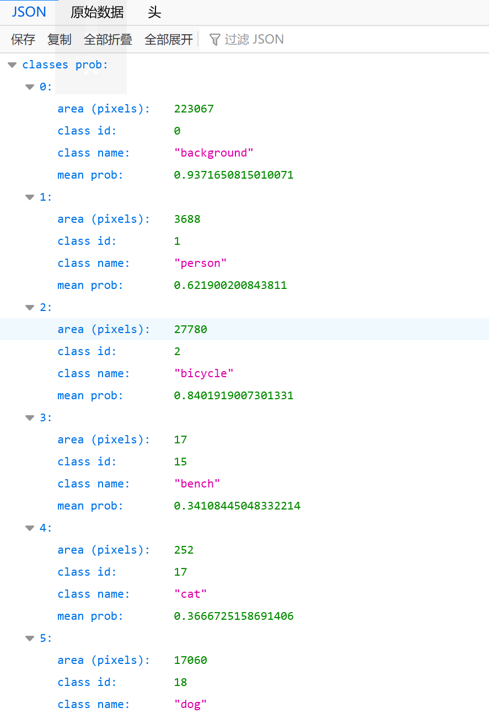
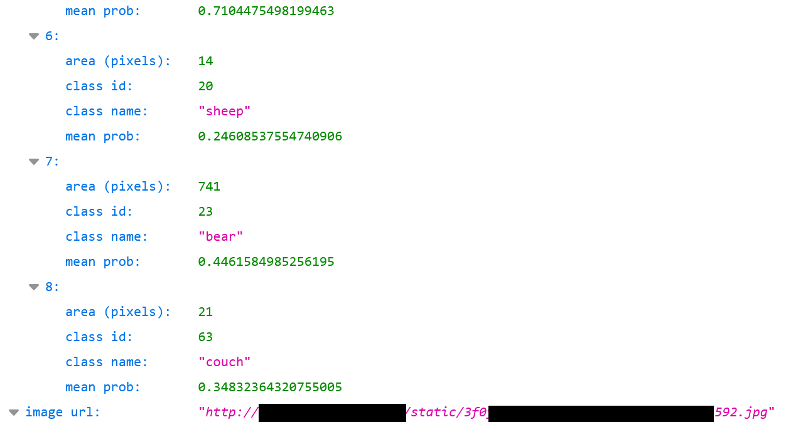

# COCO-Segmentation

## 简介

本项目使用经典的深度学习语义分割模型U-Net，在公开数据集COCO上完成了自然图像的多类别语义分割任务，并使用flask制作简单的服务。最终成果如下图所示。

图：flask搭建的简单服务效果示例。

## 文件说明

1. 可执行文件
   1. `cocomask_to_numpy.py`：从coco数据集制作numpy格式的mask。
   2. `train.py`：训练。
   3. `test.py`：对val_image进行测试，计算mIoU和各类别IoU，输出成`./save/log_test.log`。画出混淆矩阵，输出成`./save/vision_confusion_matrix.jpg`。
   4. `test_draw.py`：画测试图，计时。
   5. `./app/main.py`：启动flask服务。
2. 其他文件
   1. `./app/`：flask服务。
   1. `./model/`：unet模型。
   1. `./README_image/`：文档的图片。
   1. `./save/`：储存train、test、test_draw的输出结果。
   1. `./utils/`：train过程中的数据集、损失函数、优化器等。
   1. `./config.py`：train和test的参数。

## 数据准备

### COCO数据集简介

MS COCO的全称是Microsoft Common Objects in Context，起源于微软于2014年出资标注的Microsoft COCO数据集，与ImageNet竞赛一样，被视为是计算机视觉领域最受关注和最权威的比赛之一。 

COCO数据集是一个大型的、丰富的物体检测，分割和字幕数据集。这个数据集以scene understanding为目标，主要从复杂的日常场景中截取，图像中的目标通过精确的segmentation进行位置的标定。图像包括91类目标，328,000影像和2,500,000个label。目前为止有语义分割的最大数据集，提供的类别有80类，有超过33万张图片，其中20万张有标注，整个数据集中个体的数目超过150万个。

### COCO数据集使用

本项目只使用用于语义分割的部分。在COCO数据集官网(https://cocodataset.org/)下载train2017、val2017、annotations_trainval2017作为原始数据。在ubuntu系统下使用python库pycocotools，即可完成对coco数据集的操作。

训练集train2017包含118287张jpg格式不同尺寸的彩色自然图像，如下图所示。测试集val2017中包含5000张图像。instances_train2017.json和instances_val2017.json文件包含它们的语义分割标注。共有80种标注类别，但类别id序号是从1到90。

数据下载后，将`./config.py`中`self.dir_coco`改为数据保存的地址。

图：COCO数据集图片示例

为了方便起见，将从原本的json标注格式转化为mask格式，即每张图片对应一个相同shape的标注图像，标注图像的每个像素值为0到90，0表示背景，1~90为类别id。每个像素只能被划分为一个类别。最终储存为numpy格式。这一步的代码为`cocomask_to_numpy.py`。

## 神经网络模型

本项目使用经典的语义分割模型Unet。

U-Net简介：略。。。

代码：使用pytorch框架，代码参考：https://github.com/milesial/Pytorch-UNet。

本项目中的unet代码在`./model/unet.py`。

一些细节：模型的编码器部分使用在每次卷积层后使用BatchNorm作正则化处理，使用ReLU作为激活函数。解码器部分使用双线性上采样。最终输出结果未进行sigmoid操作。

## 数据预处理

将jpg图像、制作好的numpy格式的mask整理成pytorch格式的数据集。

数据处理包括如下几步：

1. 读取图像和标注。如果图像是2通道的黑白图像，转化为3通道格式。
2. 数据增强：
   1. 随机缩放。在保持原图长宽比例的情况下缩放为0.75到1.25倍大小。
   2. 随机翻转。作随机的水平方向翻转。
3. 统一输入尺寸。在图像中随机剪裁出网络输入大小，方便批量输入。网络输入尺寸默认为[512,512]。如果图像尺寸不够则重复扩张。
4. 转化为tensor格式。图像从[height,width,channel]改为[channel,height,width]格式。

这部分代码为`./utils/dataset.py`。

## 训练

### 训练参数
1. optimizer: Adam
1. learning rate: 1e-4
1. criterion: focal loss
1. scheduler: CosineAnnealingLR
1. num_channels: 3
1. num_classes: 91
1. crop_shape: [512, 512]

前四项为训练过程的参数，后三个为网络输入的参数，即网络要求输入的图片形状为[3, 512, 512]，预测类别数量为91。

优化器选择比较常用的Adam，也可以使用其他的，例如SGD等。

学习率初始值在实验中自行调整。

学习率调整方法选择比较常用的CosineAnnealingLR，也可以使用其他的。

损失函数选择focal loss，可以提高数量较少的类别的识别正确率。在后文中有更详细的说明。

要实际运行的话需要在config.py中更改一些文件路径。

### 损失函数

常见的用于语义分割的损失函数包括：cross entropy loss（交叉熵）, focal loss, dice loss, lovasz loss。

对比分析：略。。。

focal loss：在交叉熵的基础上修改，增加了分类不准确的样本在损失函数中的权重，常用于不同类别标注数量不平衡的情况。

在本项目中focal loss的参数设置：alpha=0.9, gamma=4。这部分代码在`./utils/criterion.py`。

### 代码和训练结果

训练时需要先在`./config.py`中设置好训练参数，之后运行`./train.py`即可。

最终得到的模型为`./save/model_final.pth`。总训练次数大约160轮，每轮都使用所有训练数据（118287张图片）。

## 测试

### 计算模型在val数据中的mIoU

运行`./test.py`，计算各个类别的IoU和最终的mIoU，输出结果保存在`./save/log_test.log`。并将所有类别的混淆矩阵（confusion matrix）可视化，图片保存在`./save/vision_confusion_matrix.jpg`。

模型在val数据中的mean IoU为0.30，其中对人的IoU达到0.84。更多类别的IoU数据可在`./save/log_test.log`中查看。

### 对图片进行分割

运行`./test_draw.py`，其中draw函数实现了对train和val分别取20个图片进行分割并将结果保存在`./save/draw`中，compute_time函数对100张图片进行分割并计算平均时间。

### 使用flask搭建简单的服务

在`./app`中包含了所有flask服务相关的代码。实现了上传图片，分割并显示分割结果图片，使用json格式给出图像中各个类别的面积（像素数）和平均置信度以及分割结果图片的url链接。

效果如下：

在浏览器中进入http://xxx.xx.xxx.xx:xxxxx/页面（ip地址和端口），此时页面如下图所示：

图：flask初始页面

点击浏览按钮，可选择本地图片，之后点击submit完成上传并分割，在页面下方会显示分割结果图片，如下图所示：

图：flask分割结果图片展示

如果希望得到json格式的结果，可以在浏览器中进入http://xxx.xx.xxx.xx:xxxxx/json页面，此时页面和之前相同，上传图片并预测后返回json格式的结果，如下图所示：

图：flask页面json结果

在classes prob中，给出了这张图中识别出的9个类别，每个类别给出了面积、类别编号、类别名称、平均置信度。可以看出，其中背景、人、自行车、狗的识别置信度超过50%。

在最后的image url中给出了分割结果图片的保存位置，点击这个链接可以获得结果图片。

运行`./app/main.py`前，需要更改其中`app.run(host, port)`，以及`jsonify`中的image url。